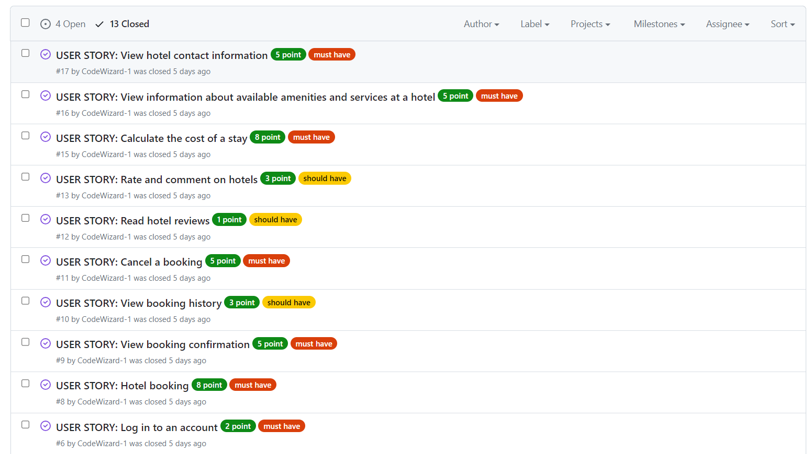
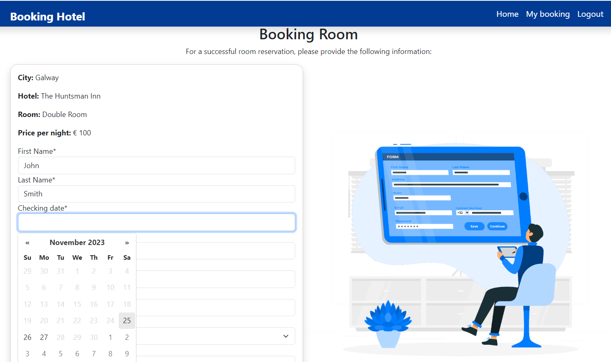

 

[View the deployed site on Heroku](https://booking-hotel-a07bb3df7136.herokuapp.com/)
## Table Of Contents:
1. [Design & Planning](#design-&-planning)
    * [User Stories](#user-stories)
    * [Wireframes](#wireframes)
    * [Agile Methodology](#agile-methodology)
    * [Typography](#typography)
    * [Colour Scheme](#colour-scheme)
    * [Database Diagram](#database-diagram)
    
2. [Features](#features)
    * [CRUD Functionality](#crud-functionality)
    * [Authentication \& Authorisation](#authentication--authorisation)
    * [Navigation](#Navigation-bar)
    * [Home page](#home-page)

3. [Technologies Used](#technologies-used)
4. [Libraries](#libraries-used)
5. [Testing](#testing)
6. [Bugs](#bugs)
7. [Deployment](#deployment)
8. [Credits](#credits)

## Design & Planning:

### User Stories
User Story 1: As a website user, I want to see a list of available hotels in a selected city so I can choose one for booking.

User Story 2: As a website user, I want to see detailed information about a hotel, including photos, prices, and descriptions, to make an informed decision

User Story 3: As a website user, I want to have the ability to filter hotels by various criteria, such as price, rating, and location, to simplify my selection
User Story 4: As a website user, I want a search function to find a hotel by its name, so I can quickly locate a specific hotel

User Story 5: As a website user, I want to register an account to access additional features, such as saving favorite hotels

User Story 6: As a website user, I want the option to recover my password if I forget it, to regain access to my account

User Story 7: As a website user, I want the ability to book a hotel by selecting dates and providing necessary information

User Story 8: As a website user, I want to see a booking confirmation with order details

User Story 9: As a website user, I want to see my past booking history to keep track of and manage my reservations

User Story 10: As a website user, I want the option to cancel a hotel booking in case my plans change

User Story 11: As a website user, I want to read reviews from other guests about hotels to evaluate service quality

User Story 12: As a website user, I want to be able to like and comment to share my experience

User Story 13: As a website user, I want to add hotels to my favorites list for future consideration

User Story 14: As a website user, I want to see the total cost of my stay, including any additional expenses

User Story 15: As a website user, I want to see information about the amenities and services offered by each hotel

User Story 16: As a website user, I want to see the contact information for hotels to get in touch with them

User Story 17: As a website user, I want the ability to log in to my account using my username and password

### Wireframes

**Interface Model**
The interface models for the project are shown below:
                    
### Agile Methodology
When working on the project using the Agile approach, I took each user story and carefully determined its significance and priority. I introduced labels to distinguish tasks by their importance.

**Definition and Planning:**

At the beginning of each iteration, I conducted planning and selected user stories for work. I identified which ones were "must-have" for the successful completion of the project and which were "could-have" or "should-have" for improving functionality.

**Iteration Creation:**

Each iteration represented a specific period, usually a few days, during which I focused on completing the selected user stories.

**Applying Labels and Updating Status:**

Labels like "must-have," "should-have," and "could-have" were used to indicate the importance of the task. 

**Updating on the Kanban Board:**

The Kanban board on GitHub visualized the entire development process. Moving tasks through columns reflected their current status, from "To Do" to "In Progress," and "Done."

**Regular Reviews and Retrospectives:**

At the end of each iteration, I conducted a review of completed work and held a retrospective to identify improvements in the process.

**Repetition:**

In the next iteration, I took new user stories, re-evaluating their priority and importance to continue the project's development.

This approach helped me effectively manage priorities and focus on important tasks in each iteration, ensuring the project progressed in the desired direction.

### Typography
I chose the Roboto and Lato fonts from Google Fonts for the project. Roboto with a weight of 300 gives a modern and lightweight appearance, ensuring good readability. Lato (weights 300 and 700) provides versatility and the ability to emphasize different parts of the content. These fonts convey modernity and professionalism, which is important for a hotel booking website.

### Colour Scheme
I chose blue, light blue, and white for my project. Blue for trust and professionalism, light blue for calmness and comfort, and white for cleanliness and clarity. These colors create a pleasant and professional atmosphere, which is important for a hotel booking website.

### Database Diagram

**Data base Models**
The data models for the project are shown below:

 

## Features:

**CRUD Functionality**

CRUD user functionality is primarily related to Booking:
- Create: Users create a reservation by going through the entire user flow. The reservation is created after the user completes the checkout process.
- Read: Users can view the reservations they have created by logging in.
- Update: Users can edit a Booking by changing the information.
- Delete: Users can cancel a reservation, which will remove it from the database.

CRUD administration functionality exists for all models and is executed from the Django admin panel.

**Authentication & Authorisation**

Users can create an account on the registration page.
Users can login from the login page.
Login is required to access certain pages such as Booking, My Bookings and Edit Bookings. Requesting these pages without authorization will redirect users to the login page.

login page

If the user is not logged in at the time of booking a room, a modal window is displayed on the screen informing them of the need to register or log in using their username.

If an authorized user decides to log out of their account, they will see the following message:

**Navigation**

The main navigation is located in the header and is present on all pages.
The hamburger menu is present on mobile devices and expands to show the main navigation links.

**Search**

The hotel search form by city is located on the main page and allows users to search for hotels by selecting a city from a drop-down menu, the desired check-in date and check-out date.
After which the user is redirected to a page that displays all hotels in the selected city.

**Home page**

On the main page there is a block with the advantages of booking on this site

The next block is a block with selected offers of rooms from different hotels. The user can see basic information about the room, such as city, price per night, number of likes, hotel and room name. By clicking on the room card, the user will go directly to the room page.

You can control which rooms will be added to this block on the main screen from the admin panel.

The next block comes with selected hotels.

Which hotels will be added to the main screen are also controlled from the admin panel.

**Hotels**

When searching for hotels in a specific city, the user is taken to a page with a list of hotels with an image of the hotel and brief information about the hotel.

After selecting a hotel, the user clicks the “Show rooms and prices” button and goes to the hotel page with a detailed description and room options.

After a brief overview of the room options at a given hotel, the user can select “More details” to learn more about the selected room.
On the page of the selected room, the user can learn more about the room, read reviews about it, and if he has already been to this room before, he can leave his review about the room and like it if he wants.
Only authorized users can leave reviews and like.

After the user has decided to book a room and clicks the “Book Now” button, he is taken to the booking page where he needs to enter the necessary information.

After the user has entered the necessary data correctly, he is redirected to a page informing the user about the successful reservation.

If necessary, the user can immediately edit his data by clicking on the "Edit booking" button

After changes are made, the user is automatically redirected to the "My Bookings" page.
On this page, he can also go to the booking edit page or, if necessary, cancel the booking by clicking on the “Cancel booking” button.

When choosing to cancel a booking, a modal window will appear in front of the user asking them to confirm the specified actions, and only after the user confirms the booking will the booking be cancelled.

Canceled bookings are removed from the database but remain on the user’s page; the status changes to “Canceled” and the buttons become inactive. Moreover, if the user has several bookings, then bookings with an active status will go first, and those with an inactive status will be shuffled to the end of the list and come after the active ones.

**Future Implementations**

Functionality that is not in the scope of this project but may be added later to improve the user experience:
 - search for hotels by name;
 - add hotels to favorites:
 - password recovery

## Technologies Used

**Core Development Technologies**
- Django used as a full-stack framwork for developing the app.
- JavaScript used for client-side interaction and validation.
- HTML/CSS + Django Template Language used for building out site pages.

**Libraries, Frameworks and Packages**
- [Tailwind CSS](https://tailwindcss.com/) - used to style elements throughout the site.
- [Flowbite](https://htmx.org/) - a Tailwind-based open-source library; used very sparingly for small number of minor components in the site (radio select, dropdown select)

**Python/Django Packages**

- [Gunicorn](https://pypi.org/project/gunicorn/) - provides HTTP server.
- [psycopg2](https://pypi.org/project/psycopg2/) - provides PostgreSQL connection.
- [Pillow](https://pypi.org/project/Pillow/) - used for image processing (Model ImageField).
- [Whitenoise](https://pypi.org/project/whitenoise/) - used for serving static files.
- [Django Markdown Field](https://pypi.org/project/django-markdownfield/) - adds a markdown-compatible text field to admin panel (for BlogPost model).
- [Black](https://pypi.org/project/black/) - A PEP8 compliant code formatter.

**Infrastructural Technologies**

* Git -  Version control.
* [GitHub](https://github.com/) - All files for the website stored and saved in a repository.
* Gitpod - IDE used to write the code.
* [Drawsql](https://drawsql.app/) -For creating a date base model
* [Heroku](https://dashboard.heroku.com/apps) - For deployment of the project.
* [Cloudconvert](https://cloudconvert.com/) - For compression of image files to improve website performance.
* [UiDev](https://ui.dev/amiresponsive) - For generating an image of the deployed app on devices
- [PostgreSQL](https://www.postgresql.org/) (via Digital Ocean) - used for database.
- [Cloudinary](https://cloudinary.com/) - used for storing static files and media files.

## Testing

### Google's Lighthouse Performance

All pages were tested using Lighthouse with the primary goal of identifying performance and accessibility issues.
The Lighthouse test results are shown below:

**Home**

**Hotels**

**Hotel page**

**Room page**

**Booking page**

### Browser Compatibility

### Responsiveness

Responsiveness testing was done using Chrome Dev Tools and ResponsivityApp.
The website has been thoroughly tested on emulated mobile devices, tablets and widescreen screens of various sizes.

| Device             | iPhone SE   | iPhone X    | iPhone 12 Pro | iPhone 13 Pro Max | iPhone 14 Pro Max | iPad         | iPad Air     | iPad Pro      | Macbook Pro  |
| ------------------ | ----------- | ----------- | ------------- | ----------------- | ----------------- | ------------ | ------------ | ------------- | ------------ |
| **Resolution**     | **375x667** | **375x812** | **390x844**   | **414x76**        | **414x896**       | **768x1024** | **820x1180** | **1024x1366** | **1440x900** |
| Render             | Pass        | Pass        | Pass          | Pass              | Pass              | Pass         | Pass         | Pass          | Pass         |
| Layout             | Pass        | Pass        | Pass          | Pass              | Pass              | Pass         | Pass         | Pass          | Pass         |
| Functionality      | Pass        | Pass        | Pass          | Pass              | Pass              | Pass         | Pass         | Pass          | Pass         |
| Links              | Pass        | Pass        | Pass          | Pass              | Pass              | Pass         | Pass         | Pass          | Pass         |
| Images             | Pass        | Pass        | Pass          | Pass              | Pass              | Pass         | Pass         | Pass          | Pass         |
| Portrait/Landscape | Pass        | Pass        | Pass          | Pass              | Pass              | Pass         | Pass         | Pass          | Pass         |

### Code Validation
- All HTML pages were checked using the [W3C Markup Validation Service](https://validator.w3.org/) and found no major errors:

**Home**

**Hotels**

**Hotel page**

**Room page**

**Booking page**

- CSS page was also checked using the [W3C Markup Validation Service](https://validator.w3.org/) and found no errors:

- All JavaScript files passed through [JSHint](https://jshint.com/)t without errors.

- All custom code Python files were formatted using the PEP8 - [Black](https://pypi.org/project/black/) complaint formatter.

### Manual Testing

- Responsiveness was tested according to the table above.
- All HTML files passed the W3C validator without errors.
- The CSS file also passed the W3C validator without errors.
- All JavaScript files passed through JSHint without errors.
- Navigation through the booking process, entering search queries, clicking on buttons when going to descriptions of hotels and rooms, sending reviews and likes about the room, links, and forms were also thoroughly tested.
-All forms have been tested to ensure they are validated and can be submitted without errors.
- Lighthouse was used to test performance, accessibility, SEO, and modifications were made to improve testing results.

**General Testing**

| Test                  | Action                                                                                                                                                                                         | Success Criteria                                                              |
| --------------------- | ---------------------------------------------------------------------------------------------------------------------------------------------------------------------------------------------- | ----------------------------------------------------------------------------- |
| Homepage loads        | Navigate to website URL                                                                                                                                                                        | Page loads < 3s, no errors                                                    |
| Links                 | Click on each Navigation link, CTA, button, logo, footer link                                                                                                                                  | Correct page is loaded/correct action performed, new tab opened if applicable |
| Form validation       | Enter data into each input field, ensure only valid data is accepted                                                                                                                           | Form doesn't submit until correct data entered, error message shown           |
| Lighthouse            | Perform Lighthouse test on each page for the primary user flow                                                                                                               | Score of > 92 on Performance, Accessibility, Best Practices                   |

**Homepage & Search Testing**

| Test                         | Action                                                                                                             | Success Criteria                                                                                                                                                                                                                            |
| ---------------------------- | ------------------------------------------------------------------------------------------------------------------ | ------------------------------------------------------------------------------------------------------------------------------------------------------------------------------------------------------------------------------------------- |
| Selecting a city and check-in check-out dates | Сlick on the field with the city from the drop-down list, select the city you need, then select the dates and click find                                                                                | - Drop down menu opens with correct data. - Text input disabled.  - Dropdown closes on click outside.  - Correct selection added to field.   -Dates until today are blocked 

| Test                         | Action                                                                                                             | Success Criteria                                                                                                                                                                                                                            |
| ---------------------------- | ------------------------------------------------------------------------------------------------------------------ | ------------------------------------------------------------------------------------------------------------------------------------------------------------------------------------------------------------------------------------------- |
| Selecting a room or hotel from the home page | Click on the card with the room or hotel                                                                              |- the cursor will become active  -card will increase in size - description change color to blue -clicking will take you to a page with detailed information
 
 

**Room booking**
| Test                         | Action                                                                                                             | Success Criteria       
| ---------------------------- | ------------------------------------------------------------------------------------------------------------------ | ------------------------------------------------------------------------------------------------------------------------------------------------------------------------------------------------------------------------------------------- |
| Booking a room by an unauthorized user | Clicking the "Book now" button by an unauthorized user |A dialog box will appear asking you to log in or register on the site. |

| Test                         | Action                                                                                                             | Success Criteria       
| ---------------------------- | ------------------------------------------------------------------------------------------------------------------ | ------------------------------------------------------------------------------------------------------------------------------------------------------------------------------------------------------------------------------------------- |
| Booking a room by an authorized user | Clicking the "Book now" button by an authorized user |A page for entering information appears in front of the user. |

| Test                         | Action                                                                                                             | Success Criteria       
| ---------------------------- | ------------------------------------------------------------------------------------------------------------------ | ------------------------------------------------------------------------------------------------------------------------------------------------------------------------------------------------------------------------------------------- |
| The user enters incorrect data in the First Name and Last Name fields | Clicking the "Book now" button r | A message appears that the data was entered incorrectly and that the data entered was incorrect. |

| Test                         | Action                                                                                                             | Success Criteria       
| ---------------------------- | ------------------------------------------------------------------------------------------------------------------ | ------------------------------------------------------------------------------------------------------------------------------------------------------------------------------------------------------------------------------------------- |
| If the user does not enter data in the Checking date and Checkout date fields (leave them blank) | Clicking the "Book now" button r | A calendar widget will open in the Checking date and Checkout date fields, which must be filled in. |

| Test                         | Action                                                                                                             | Success Criteria       
| ---------------------------- | ------------------------------------------------------------------------------------------------------------------ | ------------------------------------------------------------------------------------------------------------------------------------------------------------------------------------------------------------------------------------------- |
If the user enters the same data in the Checking date and Checkout date fields | Clicking the "Book now" button | The message "Check-out date must be later than check-in date" appears. |

Test                         | Action                                                                                                             | Success Criteria       
| ---------------------------- | ------------------------------------------------------------------------------------------------------------------ | ------------------------------------------------------------------------------------------------------------------------------------------------------------------------------------------------------------------------------------------- |
If the user entered a date in the Checking date field later than the date in the Checkout date field | Clicking the "Book now" button  | The message "Check-out date must be later than check-in date" appears. |

| Test                         | Action                                                                                                             | Success Criteria       
| ---------------------------- | ------------------------------------------------------------------------------------------------------------------ | ------------------------------------------------------------------------------------------------------------------------------------------------------------------------------------------------------------------------------------------- |
If the user wants to enter dates for which this room is already booked or dates before the current day |Opens a calendar with dates  | All dates before the current day, as well as dates on which this room is already booked, will be displayed as inactive. |

| Test                         | Action                                                                                                             | Success Criteria       
| ---------------------------- | ------------------------------------------------------------------------------------------------------------------ | ------------------------------------------------------------------------------------------------------------------------------------------------------------------------------------------------------------------------------------------- |
If the user enters incorrect data in the Phone Number field | Clicking the "Book now" button  | A message appears stating that the data was entered incorrectly and how to enter the data correctly. |

| Test                         | Action                                                                                                             | Success Criteria       
| ---------------------------- | ------------------------------------------------------------------------------------------------------------------ | ------------------------------------------------------------------------------------------------------------------------------------------------------------------------------------------------------------------------------------------- |
If the user enters an incorrect email address | Clicking the "Book now" button  | A message appears stating that the data was entered incorrectly and how to enter the data correctly. |

| Test                         | Action                                                                                                             | Success Criteria       
| ---------------------------- | ------------------------------------------------------------------------------------------------------------------ | ------------------------------------------------------------------------------------------------------------------------------------------------------------------------------------------------------------------------------------------- |
If the user entered the number of children but did not enter their age | Clicking the "Book now" button  | A message appears stating that the data was entered incorrectly and how to enter the data correctly. |

| Test                         | Action                                                                                                             | Success Criteria       
| ---------------------------- | ------------------------------------------------------------------------------------------------------------------ | ------------------------------------------------------------------------------------------------------------------------------------------------------------------------------------------------------------------------------------------- |
| if the user entered the age of the children but did not enter their number | Clicking the "Book now" button  | A message appears stating that the data was entered incorrectly and how to enter the data correctly. |

| Test                         | Action                                                                                                             | Success Criteria       
| ---------------------------- | ------------------------------------------------------------------------------------------------------------------ | ------------------------------------------------------------------------------------------------------------------------------------------------------------------------------------------------------------------------------------------- |
|if the user has entered the incorrect age of the children | Clicking the "Book now" button  | A message appears stating that the data was entered incorrectly and how to enter the data correctly. |

### Automated testing

## Bugs

| Bug | Fix
|:-------:|:--------|
|   |    |
## Deployment
This website is deployed to Heroku from a GitHub repository, the following steps were taken:

#### Creating Repository on GitHub
- First make sure you are signed into [Github](https://github.com/) and go to the code institutes template, which can be found [here](https://github.com/Code-Institute-Org/gitpod-full-template).
- Then click on **use this template** and select **Create a new repository** from the drop-down. Enter the name for the repository and click **Create repository from template**.
- Once the repository was created, I clicked the green **gitpod** button to create a workspace in gitpod so that I could write the code for the site.

#### Creating an app on Heroku
- After creating the repository on GitHub, head over to [heroku](https://www.heroku.com/) and sign in.
- On the home page, click **New** and **Create new app** from the drop down.
- Give the app a name(this must be unique) and select a **region** I chose **Europe** as I am in Europe, Then click **Create app**.

#### Create a database On ElephantSQL
- Log into the [ElephantSQL](https://www.elephantsql.com/) website and click **Create new Instance**
- Enter a **Name** and keep the plan as **Tiny Turtle Free**, then **tags** field can be left blank, Select a region closest to you, I selected **EU-West-1(Ireland)** as I'm in Ireland. Then click **Review** and afterward click **create an instance**.
- On The Dashboard click on your database instance name.
- You will see the details for your database instance, in the URL section click on the copy icon to copy the database URL.
- Head over to gitpod and create a **Database URL** environment variable in your env.py file and set it equal to the copied URL.

#### Deploying to Heroku.
- Head back over to [heroku](https://www.heroku.com/) and click on your **app** and then go to the **Settings tab**
- On the **settings page** scroll down to the **config vars** section and enter the **DATABASE_URL** which you will set equal to the elephantSQL URL, create **Secret key** this can be anything,
**CLOUDINARY_URL** this will be set to your cloudinary url and finally **Port** which will be set to 8000.
- Then scroll to the top and go to the **deploy tab** and go down to the **Deployment method** section and select **Github** and then sign into your account.
- Below that in the **search for a repository to connect to** search box enter the name of your repository that you created on **GitHub** and click **connect**
- Once it has been connected scroll down to the **Manual Deploy** and click **Deploy branch** when it has deployed you will see a **view app** button below and this will bring you to your newly deployed app.
- Please note that when deploying manually you will have to deploy after each change you make to your repository.
## Credits

